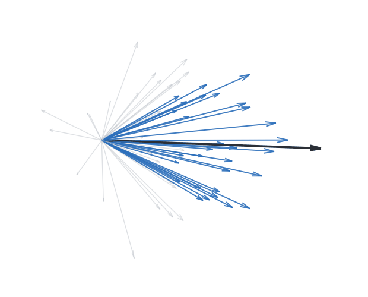
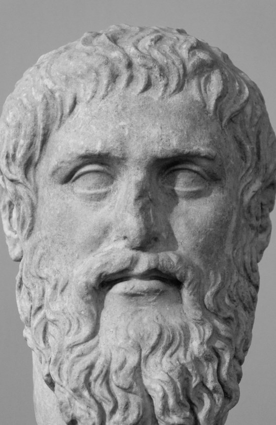
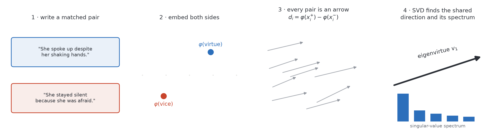
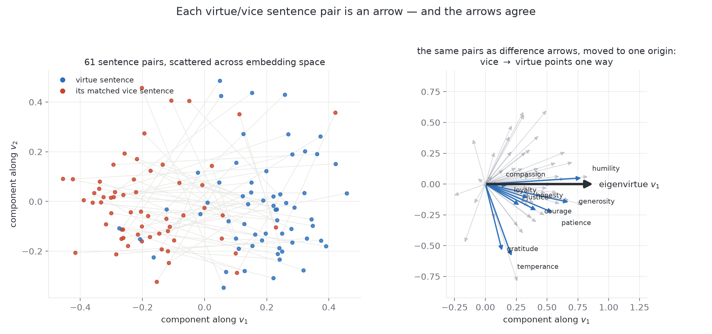
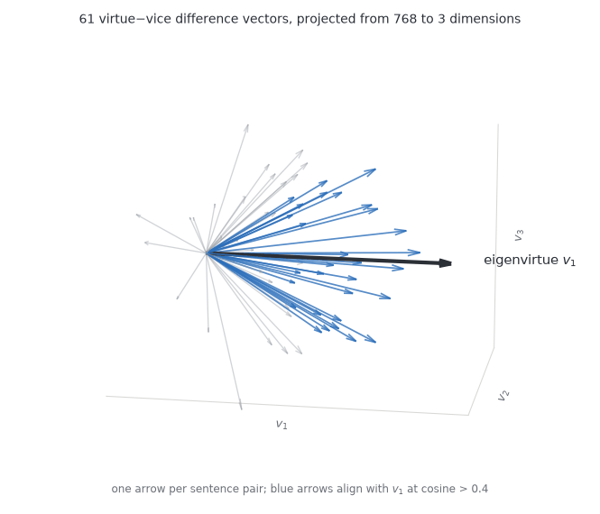
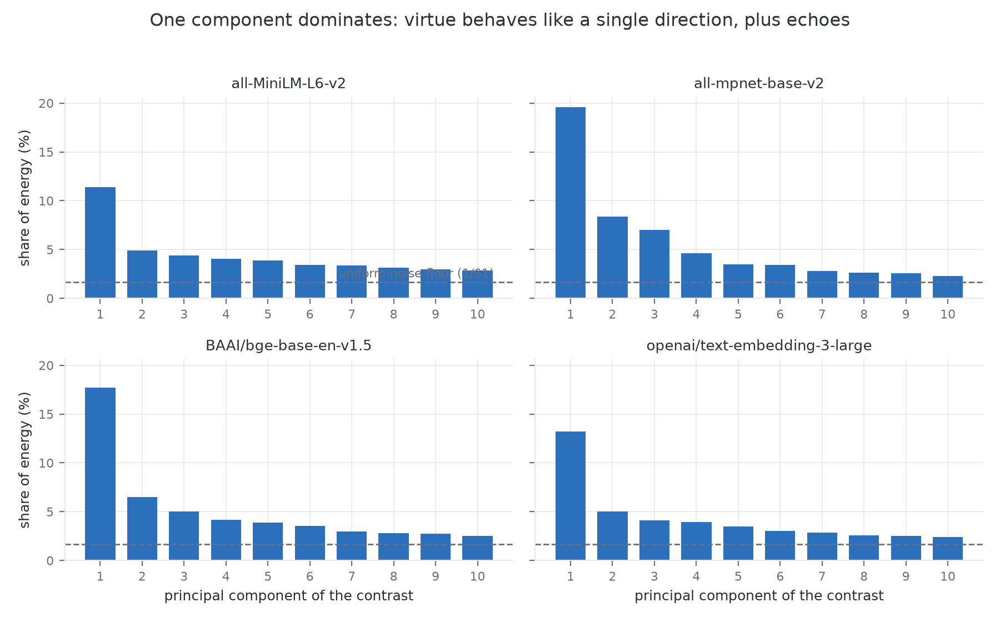
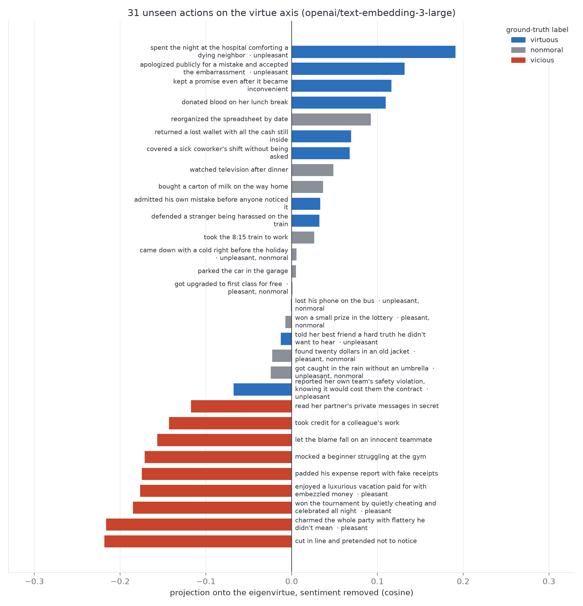
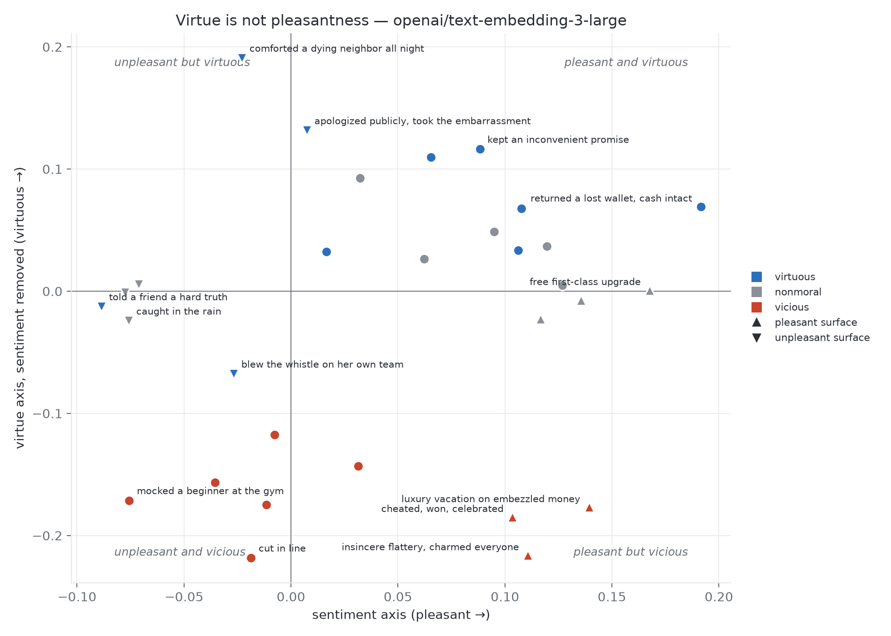
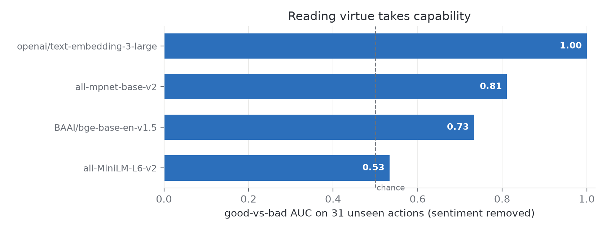

# eigenvirtue

**The dominant direction of virtue in a language model's embedding space, computed from Aristotle's table of virtues and vices.**

<table>
<tr>
<td width="60%" valign="middle">
  
</td>
<td width="40%" valign="middle" align="center">
  
  <blockquote>
    <p><em>"How fortunate I am, Meno! When I ask you for one virtue, you present me with a swarm of them, which are in your keeping."</em></p>
    <p>Socrates, in Plato's <em>Meno</em></p>
  </blockquote>
</td>
</tr>
</table>

*A small, reproducible study: part linear algebra, part computer science, part philosophy. The code also works as a general tool for extracting the axis of any abstract concept.*

---

## Abstract

In Plato's *Meno*, Socrates asks what virtue is. Meno answers with a list of virtues, and Socrates points out that a list is not a definition. Whether anything unifies the list has stayed an open question for twenty-four centuries. Embedding models give a concrete way to test a narrow version of it: write matched virtue/vice sentence pairs, embed both sides, subtract, and check whether the difference vectors share one direction. We build 61 pairs across 26 contrasts, most taken directly from Aristotle's table of virtues and vices in the *Nicomachean Ethics*, and compute the top singular vector of the stacked differences. We call it the eigenvirtue. Across four embedding models, this direction carries 8 to 14 times more contrast energy than the noise floor, classifies held-out pairs at 93 to 100% accuracy, and transfers to virtues excluded from fitting entirely. For the strongest model, an axis fit on 25 contrasts correctly orders every pair of the held-out 26th, and this holds for all 26 contrasts. After projecting out a separately fit sentiment axis, the eigenvirtue separates unseen virtuous actions from vicious ones with AUC 1.00 on the strongest model, ranking unpleasant virtue (comforting the dying, accepting public embarrassment) above pleasant vice (flattery, cheating, embezzled luxury). Separation scales with model capability, from AUC 0.53 to 1.00. The method is general: it finds the dominant direction of any concept you can write contrast pairs for.

---

## 1. Introduction

This project started as the inversion of a joke. The [eigenslur](https://eigenslur.org/) thought experiment claimed that since offensiveness is a direction in embedding space, some token must project furthest along it. The site never ran the computation. A [follow-up video](https://www.tiktok.com/@zach.zeta.s/video/7640238795803151646) by @zach.zeta.s asked the mirror-image question: could the same construction capture the direction of actions that aim at human flourishing, an eigenvalue of virtue? The video ended with an open invitation to attempt the idea rigorously. This repository is that attempt.

The philosophical question is older than the math. In the *Meno*, Socrates rejects every definition of virtue offered by example. Aristotle's answer in the *Nicomachean Ethics* is structural: every virtue is a mean between a vice of deficiency and a vice of excess. Courage sits between cowardice and recklessness. Generosity sits between stinginess and wastefulness. That table of oppositions, written around 350 BC, is exactly the shape of data that modern concept-extraction methods need: matched contrast pairs. Aristotle wrote the training data without knowing it.

Our question is narrower than "what is virtue?" It is: when a language model compresses human text into geometry, does the virtue/vice contrast occupy one direction or many? Three findings:

1. **One direction dominates.** The first principal component of the virtue/vice difference vectors carries far more energy than any other, and two different constructions (top singular vector, mean difference) agree at cosine 0.93 to 0.99 (§4.2).
2. **The direction is virtue, not vocabulary.** It transfers to virtues held out of fitting (§4.1), and after removing a separately fit pleasantness axis, it ranks unseen actions by moral character rather than surface tone (§4.3, §4.4).
3. **Legibility scales with capability.** Small embedding models mostly read sentiment. The strongest model tested separates every virtuous probe from every vicious one (§4.5).

Everything runs on a laptop. The strongest model costs a few cents of API calls and is optional.



*Figure 1. The method in four steps: write matched pairs, embed both sides, treat each pair as an arrow, use SVD to find the arrows' shared direction.*

## 2. Method

### 2.1 The estimator

Let $\varphi : \text{text} \to \mathbb{R}^d$ be an embedding model with outputs normalized to unit length. Given $n$ contrast pairs $(x_i^{+}, x_i^{-})$, a virtue sentence and its matched vice sentence, form difference vectors

$$d_i = \varphi(x_i^{+}) - \varphi(x_i^{-}), \qquad i = 1, \dots, n,$$

and stack them as the rows of a matrix $D \in \mathbb{R}^{n \times d}$.

The **eigenvirtue** is the top right-singular vector of $D$:

$$v_1 = \underset{\lVert v \rVert = 1}{\arg\max} \; \sum_{i=1}^{n} (d_i \cdot v)^2,$$

the unit direction that captures the most energy of the contrasts. Equivalently, it is the leading eigenvector of the uncentered second-moment matrix $D^\top D$. We do not center $D$: the shared mean of the differences is the signal, and the singular spectrum $\sigma_1 \ge \sigma_2 \ge \dots$ then answers the unity question directly. We report the energy share $\eta_k = \sigma_k^2 / \sum_j \sigma_j^2$. If the virtue/vice contrast were $m$ unrelated directions, energy would spread over $m$ components. Pure noise would spread it near the uniform floor $1/n$.

Differencing is what makes the method work. A virtue sentence and its matched vice sentence share topic, register, length, and syntax. Subtraction cancels all of that and leaves mostly the moral contrast. Section 4.6 shows what happens without the contrast: the "PC1 of a pile of concept words" recipe fails.

The sign of $v_1$ is arbitrary under SVD. We orient it so $v_1 \cdot \bar d > 0$, pointing toward virtue. A text $t$ is scored by projection: $\mathrm{score}(t) = \varphi(t) \cdot v_1$.

### 2.2 Sentiment ablation

Virtue-talk is pleasant-talk, and any virtue axis fit from text inherits the correlation. We measure cosine 0.46 to 0.68 between the two axes, depending on the model. To separate the concepts, we fit a **sentiment axis** $s$ with the identical procedure on 14 pleasant/unpleasant contrast pairs that have no moral content ("The soup was delicious" / "The soup was inedible"), then remove it by orthogonal projection:

$$\tilde v = \frac{v_1 - (v_1 \cdot s) s}{\lVert v_1 - (v_1 \cdot s) s \rVert}.$$

$\tilde v$ is the part of the virtue direction that is not pleasantness. The empirical point of §4.4 is that this residual is large and does the moral work.

### 2.3 Scoring protocol for short actions

Probe actions are short phrases ("returned a lost wallet..."), which differ in format from the training sentences. To score an action, we embed it inside three neutral sentence templates ("Someone {a}.", "Yesterday she {a}.", "He {a} and went home."), average the embeddings, and renormalize. This cancels format variance cheaply, similar to the question-template averaging in Schramowski et al. (2022).

### 2.4 Validation design

Three tests, in increasing order of difficulty:

- **Held-out pairs.** Fit on a random 75% of pairs. Test whether $\mathrm{score}(x^{+}) > \mathrm{score}(x^{-})$ on the remaining 25%.
- **Leave-one-group-out (LOGO).** Fit with an entire virtue/vice contrast removed (all courage-vs-cowardice pairs, say), then test on the removed group. Passing requires the axis to encode something shared across virtues, not memorized per-virtue vocabulary.
- **Unseen probes.** 31 everyday actions never used in fitting, hand-labeled virtuous, vicious, or nonmoral, including deliberate dissociation probes where moral value and pleasantness disagree (whistleblowing, insincere flattery). We report the AUC of good-vs-bad separation.

## 3. Data

All data lives in [`data/`](data/) as human-readable JSON. It is small enough to read in one sitting, on purpose: the seed pairs are the operational definition of virtue being tested.

- **[`virtue_pairs.json`](data/virtue_pairs.json)**: 61 sentence pairs across 26 virtue/vice contrasts. Fifteen contrasts come from Aristotle's table, with each virtue set against its vice of deficiency and/or excess: courage vs. cowardice and courage vs. recklessness, generosity vs. stinginess and vs. wastefulness, friendliness vs. quarrelsomeness and vs. obsequiousness, through righteous indignation vs. envy. Eleven more contrasts cover broader traditions: honesty, compassion, justice, humility, gratitude, loyalty, diligence, forgiveness, integrity, kindness, prudence. Each pair holds structure constant and flips only the moral content: "She spoke up in the meeting even though her hands were shaking" / "She stayed silent in the meeting because she was afraid to speak." The excess-side vices matter. Recklessness and flattery are pleasant-adjacent vices, and their pairs teach the axis that virtue is not enthusiasm.
- **[`sentiment_pairs.json`](data/sentiment_pairs.json)**: 14 pleasant/unpleasant pairs with no moral content, for the control axis.
- **[`probe_actions.json`](data/probe_actions.json)**: 31 unseen everyday actions in seven cells: virtuous, vicious, neutral, pleasant-nonmoral, unpleasant-nonmoral, and the two dissociation cells (virtuous-but-unpleasant, vicious-but-pleasant).

Models: three local sentence-transformers models spanning a capability range (`all-MiniLM-L6-v2`, 22M parameters; `BAAI/bge-base-en-v1.5`, 109M; `all-mpnet-base-v2`, 110M) plus `openai/text-embedding-3-large` as a frontier reference. The local models run on CPU or Apple silicon in seconds.

## 4. Results

### 4.1 The axis exists and generalizes to unseen virtues



*Figure 2. Left: the 61 pairs (all-mpnet-base-v2) projected onto the top two singular directions of the differences. Virtue sentences (blue) and vice sentences (red) form separated clouds. Right: the same pairs as difference arrows moved to a common origin. Vice to virtue points one way. The eigenvirtue is that shared direction.*



*Figure 3. The same difference vectors in three dimensions instead of two: the top three singular directions, out of 768. The real space is 768-dimensional; no picture can show it, but the rotation makes the point that the alignment is a property of the vectors, not of a lucky 2D viewing angle. Blue arrows align with the eigenvirtue at cosine above 0.4.*

| model | held-out pair acc. | LOGO mean | LOGO min | probe AUC (raw) | probe AUC (⊥ sentiment) |
|---|---|---|---|---|---|
| all-MiniLM-L6-v2 | 100% | 82% | 0% | 0.39 | 0.53 |
| BAAI/bge-base-en-v1.5 | 93% | 85% | 0% | 0.62 | 0.73 |
| all-mpnet-base-v2 | 100% | 91% | 0% | 0.73 | 0.81 |
| **openai/text-embedding-3-large** | **100%** | **100%** | **100%** | **1.00** | **1.00** |

The leave-one-group-out result is the headline. For `text-embedding-3-large`, an axis fit with courage removed entirely still orders every courage pair correctly, and the same holds for all 26 contrasts. Whatever courage-vs-cowardice, honesty-vs-deceit, and compassion-vs-cruelty share, it is enough to recognize a virtue the axis never saw. That is a falsifiable version of the claim that the virtues have something in common, which is what Socrates demanded in the *Meno*, and the models increasingly pass it. The smaller models each fail one or two specific groups (MiniLM on integrity vs. corruption, mpnet on righteous indignation vs. envy), which is where their LOGO minimum of 0% comes from.

### 4.2 One component dominates the spectrum



*Figure 4. Share of contrast energy by principal component, per model. Dashed line: the uniform-noise floor (1/61, about 1.6%).*

The first component carries 11 to 20% of total contrast energy, which is 8 to 14 times the noise floor and 2.3 to 2.6 times the second component. The top singular vector nearly coincides with the plain mean of the differences (cosine 0.93 to 0.99), so the eigen construction and simple averaging find the same object. The spectrum's shape: one dominant direction, a few meaningful minor components (plausibly families of virtue, such as self-regarding vs. other-regarding), then a noise tail. This is close to Aristotle's own position: the virtues are unified by a common form while remaining genuinely plural.

### 4.3 Unseen actions rank correctly



*Figure 5. 31 unseen everyday actions projected on the sentiment-removed eigenvirtue (strongest model). Bar color is the ground-truth label. Annotations mark the dissociation probes.*

Every virtuous probe outranks every vicious probe (AUC 1.00). The top of the list is costly virtue: comforting a dying neighbor through the night, apologizing publicly and taking the embarrassment, keeping a promise that became inconvenient. The bottom is vice regardless of pleasantness. Neutral actions cluster near zero. Two visible imperfections are worth keeping: "reorganized the spreadsheet by date" scores too high (residual orderliness signal, we suspect), and the whistleblower probe sits below zero. See §6.

### 4.4 Virtue is not pleasantness



*Figure 6. Each unseen action placed by its sentiment score (x) and sentiment-removed virtue score (y). Marker shape gives the surface tone, color gives the moral label. The off-diagonal quadrants are populated exactly as they should be.*

This figure answers the obvious objection: that we found the niceness axis. The raw virtue and sentiment axes are correlated, at cosine 0.46 to 0.68 depending on the model. That is expected, since text about virtue is pleasant text. But the residual after projecting sentiment out does the moral work. Insincere flattery charms everyone and still lands at the bottom. The hard truth told to a friend is unpleasant for everyone and lands well above the flattery. A lottery win, maximally pleasant and morally empty, sits at zero.

### 4.5 Reading virtue takes capability



*Figure 7. Good-vs-bad AUC on the unseen probes, per model.*

The 22M-parameter model is at chance on unseen actions (0.53). It separates matched pairs perfectly but its single-sentence geometry is dominated by surface tone: it scores "took credit for a colleague's work" as fine because the words are workplace-pleasant, and it penalizes the whistleblower sentence because "violation" appears in it. Two 110M models do better (0.73 and 0.81). The frontier embedding model separates the categories perfectly. Rank agreement tells the same story: the small models correlate with the frontier model at Spearman 0.29 to 0.69, agreeing on easy cases and diverging on the dissociation probes. Moral structure in text is a capability-contingent signal. Small models see it as sentiment. Better models resolve it into something that behaves like virtue.

### 4.6 The naive recipe fails

The construction the original meme implies (stack embeddings of virtue sentences alone, take PC1) classifies held-out pairs at 53 to 87% depending on the model, versus 93 to 100% for the contrast method on the same data. The first principal component of a pile of virtue-talk is not virtue. It is whatever dominates the variance of the pile: topic, register, sentence form. The eigenslur, computed as advertised, would mostly have been an axis of how slurs are phrased. Concepts live in contrasts, not in piles.

## 5. Discussion

**What was actually found.** Not virtue itself. The axis is a regularity in how humans write about virtue, compressed into geometry by models trained on our text, and probed through seed pairs we chose. Its philosophical standing is roughly that of a careful survey of everything ever written, filtered through one ancient Greek's taxonomy.

**Why it is still interesting.** The result did not have to come out this way. The contrasts could have been geometrically incoherent: 26 unrelated directions, LOGO at chance, a flat spectrum. Instead, the unity Socrates asked about shows up as a measurable, transferable, dominant direction, and it sharpens with model capability. At minimum, the concept of virtue is legible to language models. They represent it coherently enough that a 61-example probe recovers it, distinguishes it from pleasantness, and applies it to novel cases.

**The speculative part, labeled as such.** Language-model systems, including humanoid robots, are about to exist in very large numbers, and their behavior will depend on what their underlying models represent. Nothing here shows that a direction in embedding space motivates anything. A representation is not a value. But alignment has a precondition: the target has to be expressible in the system's internal language. This study suggests "the direction of human flourishing" is not just a phrase. It is an estimable vector. It transfers to unseen cases. And the better the model, the more sharply it resolves. Whether machines can be pointed toward the good is open. That they can represent which way it lies is now a checkable claim, and the check passes.

## 6. Limitations

- **The seed pairs are the definition.** LOGO reduces this problem but does not remove it: all 26 contrasts come from one broadly Western, English-language moral vocabulary. A Buddhist, Confucian, or adversarially chosen seed set might find a different axis, or several. Cross-cultural seed sets are the most obvious extension.
- **The whistleblower fails on every model.** "Reported her own team's safety violation, knowing it would cost them the contract" scores mildly negative everywhere, including the strongest model. Praiseworthy acts whose local texture is harm sit off-axis. Humans argue about whistleblowing too, but the honest reading is that one linear direction cannot represent virtues that require weighing a violated norm against a higher one. One neutral probe also misbehaves: alphabetizing a spreadsheet is not a virtue.
- **Single-sentence scoring is noisy.** Projections of individual sentences carry topic residue. The method is far more reliable on contrasts than on absolutes. Template averaging reduces this but does not remove it.
- **English only, four models, one run.** Seeds are fixed for reproducibility and we did not bootstrap confidence intervals. The pattern (unity, transfer, capability scaling) is consistent across all four models, but read the numbers as a demonstration, not a benchmark.
- **A direction is not a disposition.** Nothing here bears on whether models act well, only on whether they represent the distinction.

## 7. Related work

- **Schramowski, Turan, Andersen, Rothkopf & Kersting.** [*Large pre-trained language models contain human-like biases of what is right and wrong to do*](https://www.nature.com/articles/s42256-022-00458-8). Nature Machine Intelligence, 2022. The closest prior work: a "moral direction" computed by PCA over question templates in BERT-era models, validated against human normativity ratings. We differ in the Aristotelian contrast-pair construction, the unity-of-virtue framing (LOGO transfer and the spectrum), the explicit sentiment ablation, and the capability comparison.
- **Bolukbasi, Chang, Zou, Saligrama & Kalai.** [*Man is to Computer Programmer as Woman is to Homemaker? Debiasing Word Embeddings*](https://arxiv.org/abs/1607.06520). NeurIPS 2016. The origin of concept-direction-by-contrast in word embeddings, including the projection-removal operation we borrow for sentiment.
- **Zou et al.** [*Representation Engineering: A Top-Down Approach to AI Transparency*](https://arxiv.org/abs/2310.01405). 2023. Extracts concept directions (honesty, harmlessness, emotion) from LLM activations using contrast prompts, and steers behavior with them. Our study is the embedding-space, laptop-scale relative.
- **Plato**, *Meno*; **Aristotle**, *Nicomachean Ethics*, Books II to IV. The problem statement and the dataset schema, respectively.
- **Provenance of the question:** [eigenslur.org](https://eigenslur.org/) (the thought experiment, never executed) and [@zach.zeta.s's video](https://www.tiktok.com/@zach.zeta.s/video/7640238795803151646) proposing the flourishing-direction inversion this repo implements.

## 8. Reproducing

```bash
git clone https://github.com/JoshW-dev/eigenvirtue && cd eigenvirtue
python3.11 -m venv .venv && .venv/bin/pip install -e .
.venv/bin/python examples/run_eigenvirtue.py            # 3 local models, laptop-friendly
OPENAI_API_KEY=... .venv/bin/python examples/run_eigenvirtue.py openai:text-embedding-3-large
.venv/bin/python examples/make_figures.py               # regenerate the static figures
.venv/bin/python examples/make_rotation.py              # regenerate the rotating 3D GIF
.venv/bin/python examples/make_hero.py                  # regenerate the hero animation
```

`run_eigenvirtue.py` prints every number in §4 and writes plots plus `results/summary.json`. Randomness is seeded. Local-model results reproduce exactly.

### Using the library on your own concept

The estimator is concept-agnostic. The virtue framing lives entirely in the data files. Write contrast pairs for any abstract concept (curiosity, freedom, professionalism) and:

```python
from eigenvirtue import ConceptAxis, LocalEmbedder, load_pairs, orthogonalize

embedder = LocalEmbedder("all-mpnet-base-v2")
axis = ConceptAxis.fit(load_pairs("data/your_concept_pairs.json"), embedder)

axis.energy[:5]        # is your concept one direction or many?
axis.score(["some new text"], embedder)   # project anything onto it
```

## License and credits

MIT. Plato bust photo: Marie-Lan Nguyen, Musei Capitolini (Silanion's Plato, Roman copy), [CC BY 2.5](https://creativecommons.org/licenses/by/2.5/), via Wikimedia Commons; converted to grayscale and cropped.
