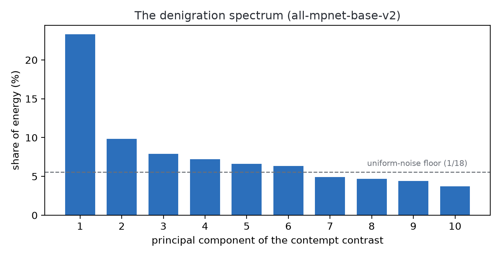

# The other pole: running the eigenslur responsibly

This whole repository exists because of a thought experiment about the opposite of virtue. In December 2025 the linguist Adam Aleksic, posting as [@etymologynerd](https://www.tiktok.com/@etymologynerd/video/7584610585300438285), made a one-minute video observing that a language model's embeddings of derogatory vocabulary share a direction, so some point must sit at its far end, and he named that point the eigenslur. The caption read "the eigenslur that can be spoken is not the true eigenslur," which works both as a Tao Te Ching joke and as a technical prediction. The longer thought experiment at [eigenslur.org](https://eigenslur.org/) defines it as "the principal component of offense, the eigenvector of linguistic cruelty," and argues from basic linear algebra that it must exist: "in any finite vocabulary projected onto any axis there is a point that projects further than every other point." It also makes the caption's prediction precise: "It might not be a word. Tokenizers don't care about meaning." The maximally offensive location in embedding space might be a byte sequence no human mouth ever shaped. Nobody ran the computation, and [a response video](https://www.tiktok.com/@zach.zeta.s/video/7640238795803151646) by @zach.zeta.s flipped the question toward human flourishing instead, which became the main study in this repo.

Fairness demands we visit the original pole, so this document runs the same math in the other direction. It is shorter and lighter than the main study, an exercise to show the method works on both ends of the axis.

## What we ran, and what we deliberately did not

We fit a **denigration axis** using the same estimator as the eigenvirtue: 18 contrast pairs across eight kinds of contempt (insult, contempt, belittling, dismissal, mockery, dehumanization, humiliation, scorn), each pairing a contemptuous sentence with a respectful phrasing of the same situation. The dataset, in [`data/denigration_pairs.json`](../data/denigration_pairs.json), contains no slurs and no group-targeted language. That is a deliberate choice, and it costs the experiment nothing: the interesting claim was always geometric (is contempt one direction?), not lexical (which word is worst?).

We also did not hunt for the maximal token, for three connected reasons. The site's own prediction is probably correct, since vocabulary extremes under any projection tend to be tokenizer debris rather than meaningful words. A ranked lexicon of contempt would help nobody even if it were meaningful. And the main study's §4.6 shows the hunt would fail anyway: projecting a raw vocabulary onto an axis fit without matched contrasts surfaces phrasing and register, not the concept. The eigenslur as originally specified would mostly have found how offensive text is formatted.

## Results

| model | PC1 energy share | held-out pair accuracy | cos vs. virtue axis | cos vs. sentiment axis |
|---|---|---|---|---|
| all-MiniLM-L6-v2 | 16.0% | 100% | -0.58 | -0.61 |
| all-mpnet-base-v2 | 23.3% | 100% | -0.76 | -0.65 |



Three observations, in increasing order of fun:

1. **The eigenslur exists.** Contempt is at least as geometrically unified as virtue. On the same model, the denigration contrast concentrates 23.3% of its energy in one direction versus 19.6% for the virtue contrast, both far above the 1/18 noise floor, and held-out pairs classify perfectly.
2. **It is not just negativity.** The axis correlates with the sentiment axis (cosine -0.65) but is far from identical to it, the same dissociation the main study found for virtue.
3. **The eigenslur is mostly the eigenvirtue times minus one.** Cosine -0.76 between the two axes means the direction of linguistic cruelty and the direction of virtue are substantially the same line, traversed in opposite directions, with a leftover component specific to contempt. The original site called it "the most offensive location in the geometry." The geometry answers that the location was never independent: cruelty lives on the far end of the virtue axis, plus a flourish of its own.

Single-phrase projections onto this axis wobble the same way they did in the main study. The contempt axis flags humiliation-adjacent content (public apologies, reported violations) whether or not anyone is being wronged, which repeats the lesson from §4.5: at small model scale these axes read surfaces, and it takes a stronger model to read structure.

## Reproduce it

```bash
.venv/bin/python examples/run_eigenslur.py
```

The script prints every number above and writes `results/eigenslur_summary.json` plus the spectrum figure. Full credit for the founding question goes to [eigenslur.org](https://eigenslur.org/), whose thought experiment turned out to be right that the axis exists, right that the extreme token would be meaningless, and wrong about only one thing: the most interesting fact about the eigenslur is that it points back at virtue.
